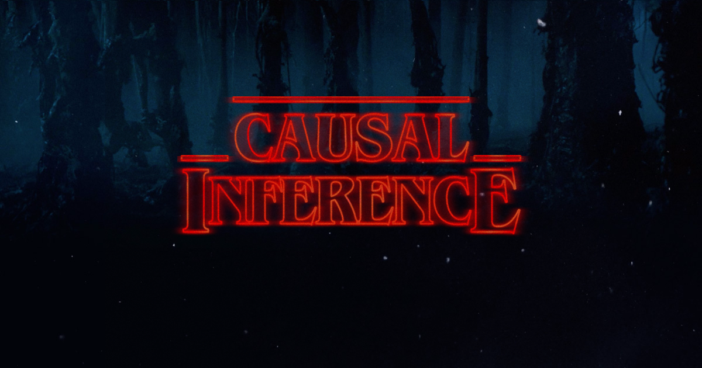

The CIIG hosts bi-monthly seminars which discuss recent advances in the field of causal inference, from both empirical and formal perspectives. Everyone with an interest in discussing causal inference is very welcome to come along and we particularly encourage PhD students and research associates.

Our presenters are drawn from both academia and industry. If you would like to present your research (or related causal inference material) at the CIIG, please contact the organisers.

For more information see the main [ATI website](https://www.turing.ac.uk/research/interest-groups/causal-inference).

## Practical details

**Where?** Currently online but eventually in the Alan Turing Institute, London, UK (but will then be streamed).\
**When?** Twice a month. Times and dates may vary. The most up-to-date schedule can be found below.

## Mailing list

**How to stay tuned?** Please subscribe to the [mailing list](https://www.jiscmail.ac.uk/cgi-bin/wa-jisc.exe?SUBED1=CIIG&A=1).

All relevant information will be posted to the list (e.g. zoom links for seminars), so stay up to date by signing up.

## Team

- Peter Tennant: [P.W.G.Tennant@leeds.ac.uk](mailto:P.W.G.Tennant@leeds.ac.uk)
- Mark Gilthorpe: [M.S.Gilthorpe@leeds.ac.uk](mailto:M.S.Gilthorpe@leeds.ac.uk)
- Neil Dhir: [ndhir@turing.ac.uk](mailto:ndhir@turing.ac.uk)

## Program

| Date | Speaker | Org | Title | Location |
| :-: | :-: | :-: | :-: | :-: |
| 18/10/21| [Ricardo Silva](http://www.homepages.ucl.ac.uk/~ucgtrbd/) | UCL | A New Class of Algorithms for Bounding Causal Effects | TBC (Online/ATI) |
| 25/10/21| [Jonathan Richens](https://scholar.google.com/citations?user=VtfYF3EAAAAJ&hl=en) | DeepMind | Counterfactual harm | TBC (Online/ATI) |
| 08/11/21| [Johannes Textor](http://johannes-textor.name/) | Nijmegen | TBC | TBC (Online/ATI) |
| 15/11/21| [Virginia Aglietti](https://scholar.google.com/citations?user=-itpVyoAAAAJ&hl=en) | DeepMind | Dynamic Causal Bayesian Optimization | TBC (Online/ATI) |
| 29/11/21| [Silvia Chiappa](https://csilviavr.github.io/) & [Alan Malek](http://alanmalek.com/) | DeepMind | Selecting the Asymptotically Best Causal Effect Estimator with Multi-Armed Bandits | TBC (Online/ATI) |
| 06/12/21| [Nicola Branchini](https://nicola144.github.io/about.html) | Edinburgh | Causal Entropy Optimization | TBC (Online/ATI) |
| 31/01/22| [Ciarán Gilligan-Lee](https://www.ciarangilliganlee.com/) | Spotify/UCL | Counterfactual inference via deep twin networks | TBC (Online/ATI) |

---

